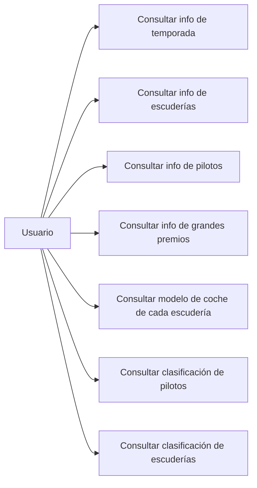

```mermaid
flowchart LR
    Usuario["Usuario"]
    UC1["Consultar info de temporada"]
    UC2["Consultar info de escuderías"]
    UC3["Consultar info de pilotos"]
    UC4["Consultar info de grandes premios"]
    UC5["Consultar modelo de coche de cada escudería"]
    UC6["Consultar clasificación de pilotos"]
    UC7["Consultar clasificación de escuderías"]
    
    Usuario --> UC1
    Usuario --> UC2
    Usuario --> UC3
    Usuario --> UC4
    Usuario --> UC5
    Usuario --> UC6
    Usuario --> UC7
```