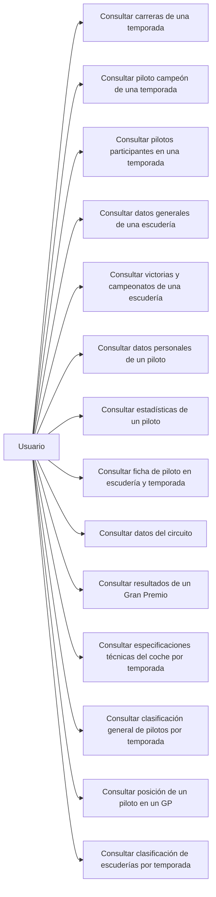

```mermaid
flowchart LR
    Usuario["Usuario"]

    TemporadaCarreras["Consultar carreras de una temporada"]
    TemporadaCampeon["Consultar piloto campeón de una temporada"]
    TemporadaPilotos["Consultar pilotos participantes en una temporada"]
    EscuderiaDatos["Consultar datos generales de una escudería"]
    EscuderiaStats["Consultar victorias y campeonatos de una escudería"]
    PilotoDatos["Consultar datos personales de un piloto"]
    PilotoStats["Consultar estadísticas de un piloto"]
    PilotoFicha["Consultar ficha de piloto en escudería y temporada"]
    GPCircuitoDatos["Consultar datos del circuito"]
    GPResultados["Consultar resultados de un Gran Premio"]
    CocheSpecs["Consultar especificaciones técnicas del coche por temporada"]
    ClasificacionPilotos["Consultar clasificación general de pilotos por temporada"]
    ClasificacionPiloto["Consultar posición de un piloto en un GP"]
    ClasificacionEscuderia["Consultar clasificación de escuderías por temporada"]

    Usuario --> TemporadaCarreras
    Usuario --> TemporadaCampeon
    Usuario --> TemporadaPilotos
    Usuario --> EscuderiaDatos
    Usuario --> EscuderiaStats
    Usuario --> PilotoDatos
    Usuario --> PilotoStats
    Usuario --> PilotoFicha
    Usuario --> GPCircuitoDatos
    Usuario --> GPResultados
    Usuario --> CocheSpecs
    Usuario --> ClasificacionPilotos
    Usuario --> ClasificacionPiloto
    Usuario --> ClasificacionEscuderia
```