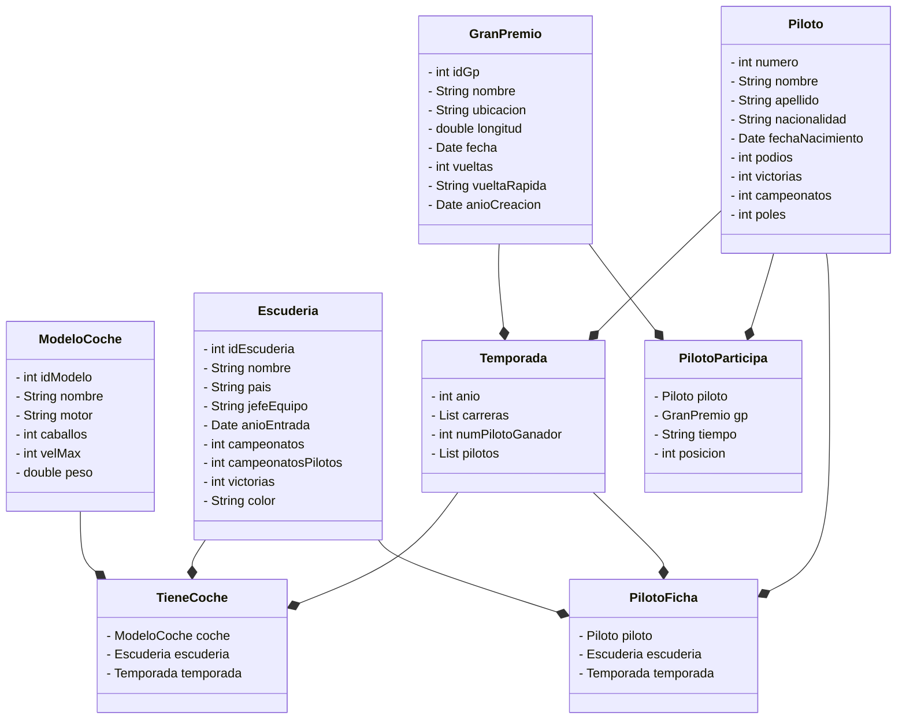

```mermaid
classDiagram
    class Piloto{
        - int numero
        - String nombre
        - String apellido
        - String nacionalidad
        - Date fechaNacimiento
        - int podios
        - int victorias
        - int campeonatos
        - int poles
    }
    class ModeloCoche{
        - int idModelo
        - String nombre
        - String motor
        - int caballos
        - int velMax
        - double peso
    }
    class Escuderia{
        - int idEscuderia
        - String nombre
        - String pais
        - String jefeEquipo
        - Date anioEntrada
        - int campeonatos
        - int campeonatosPilotos
        - int victorias
        - String color
    }
    class PilotoFicha{
        - Piloto piloto
        - Escuderia escuderia
        - Temporada temporada
    }
    class TieneCoche{
        - ModeloCoche coche
        - Escuderia escuderia
        - Temporada temporada
    }
    class GranPremio{
        - int idGp
        - String nombre
        - String ubicacion
        - double longitud
        - Date fecha
        - int vueltas
        - String vueltaRapida
        - Date anioCreacion
    }
    class PilotoParticipa{
        - Piloto piloto
        - GranPremio gp
        - String tiempo
        - int posicion
    }
    class Temporada{
        - int anio
        - List<GranPremio> carreras
        - int numPilotoGanador
        - List<Piloto> pilotos
    }

    Piloto --* PilotoFicha
    Escuderia --* PilotoFicha
    Temporada --* PilotoFicha

    Piloto --* PilotoParticipa
    GranPremio --* PilotoParticipa

    GranPremio --* Temporada
    Piloto --* Temporada

    ModeloCoche --* TieneCoche
    Escuderia --* TieneCoche
    Temporada --* TieneCoche
```
