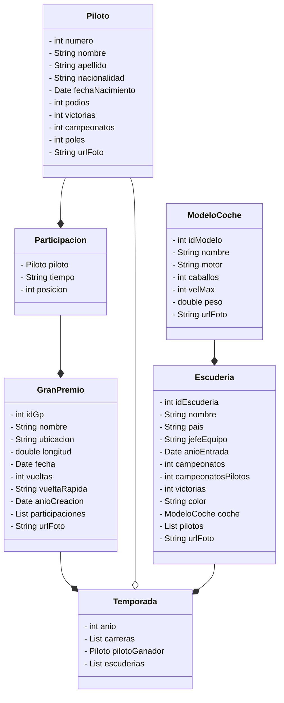

```mermaid
classDiagram
    class Piloto{
        - int numero
        - String nombre
        - String apellido
        - String nacionalidad
        - Date fechaNacimiento
        - int podios
        - int victorias
        - int campeonatos
        - int poles
        - String urlFoto
    }
    class ModeloCoche{
        - int idModelo
        - String nombre
        - String motor
        - int caballos
        - int velMax
        - double peso
        - String urlFoto
    }
    class Escuderia{
        - int idEscuderia
        - String nombre
        - String pais
        - String jefeEquipo
        - Date anioEntrada
        - int campeonatos
        - int campeonatosPilotos
        - int victorias
        - String color
        - ModeloCoche coche
        - List<Piloto> pilotos
        - String urlFoto
    }
    class GranPremio{
        - int idGp
        - String nombre
        - String ubicacion
        - double longitud
        - Date fecha
        - int vueltas
        - String vueltaRapida
        - Date anioCreacion
        - List<Participacion> participaciones
        - String urlFoto
    }
    class Participacion{
        - Piloto piloto
        - String tiempo
        - int posicion
    }
    class Temporada{
        - int anio
        - List<GranPremio> carreras
        - Piloto pilotoGanador
        - List<Escuderia> escuderias
    }

    GranPremio --* Temporada
    Piloto --o Temporada
    Escuderia --* Temporada

    Piloto --* Participacion

    Participacion --* GranPremio

    ModeloCoche --* Escuderia
```
