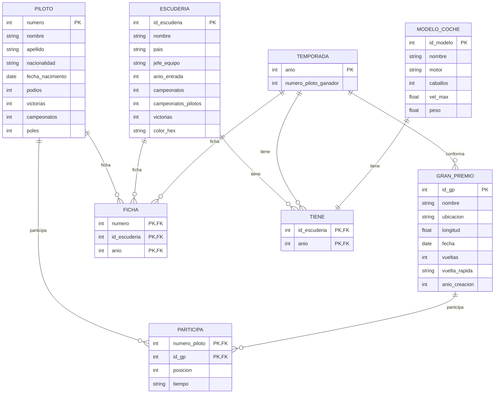

```mermaid
erDiagram
    PILOTO {
        int numero PK
        string nombre
        string apellido
        string nacionalidad
        date fecha_nacimiento
        int podios
        int victorias
        int campeonatos
        int poles
    }

    ESCUDERIA {
        int id_escuderia PK
        string nombre
        string pais
        string jefe_equipo
        int anio_entrada
        int campeonatos
        int campeonatos_pilotos
        int victorias
        string color_hex
    }

    TEMPORADA {
        int anio PK
        int numero_piloto_ganador
    }

    GRAN_PREMIO {
        int id_gp PK
        string nombre
        string ubicacion
        float longitud
        date fecha
        int vueltas
        string vuelta_rapida
        int anio_creacion
    }

    MODELO_COCHE {
        int id_modelo PK
        string nombre
        string motor
        int caballos
        float vel_max
        float peso
    }

    %% Decomposed ternary relationships and relationships-with-attributes as logical tables
    FICHA {
        int numero PK, FK
        int id_escuderia PK, FK
        int anio PK, FK
    }

    PARTICIPA {
        int numero_piloto PK, FK
        int id_gp PK, FK
        int posicion
        string tiempo
    }

    TIENE {
        int id_escuderia PK, FK
        int anio PK, FK
    }

    %% Definición de relaciones basadas en el diagrama, incluyendo cardinalidades y nombres
    PILOTO ||--o{ FICHA : "ficha"
    ESCUDERIA ||--o{ FICHA : "ficha"
    TEMPORADA ||--o{ FICHA : "ficha"

    PILOTO ||--o{ PARTICIPA : "participa"
    GRAN_PREMIO ||--o{ PARTICIPA : "participa"

    TEMPORADA ||--o{ GRAN_PREMIO : "conforma"
    
    ESCUDERIA ||--o{ TIENE : "tiene"
    TEMPORADA ||--o{ TIENE : "tiene"
    MODELO_COCHE ||--|| TIENE : "tiene"
```